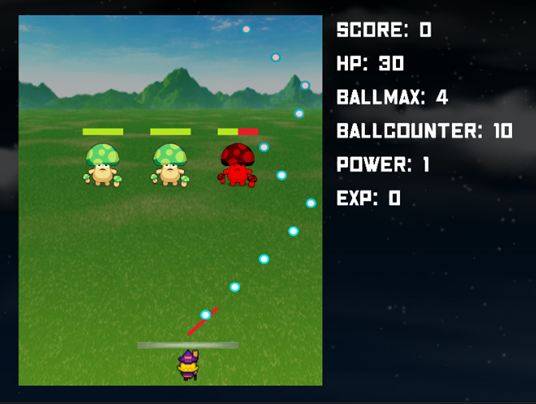
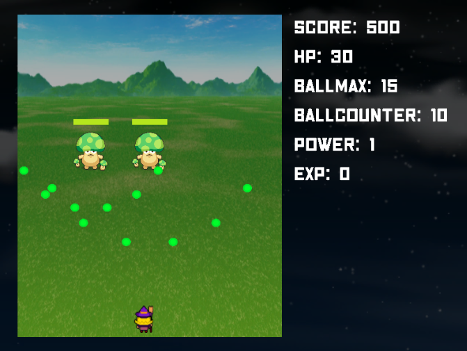

# EnemyBreaker(エネミーブレイカー)

## URL

https://unityroom.com/games/enemybreaker

## ゲーム概要
「ブロック崩し」と「シューティング」を融合させた、エキサイティングなゲーム

敵が攻撃してきたり、敵を倒すと貴重なアイテムを落とします。

ステージをクリアすると、自分の能力を向上させるためにレベルアップすることが可能です。

## 製作期間

2023/04/01 ～ 2023/05/31

## 開発環境

★言語

　C#

★ゲームエンジン

　Unity

★API

　二フクラ mobile backend
 
　https://mbaas.nifcloud.com/

　※ランキングのデータ保存に使用

## 設計書

[クラス図.xlsx](./クラス図.xlsx)

## 操作機能

「←」キー：プレイヤーを左に移動

「→」キー：プレイヤーを右に移動

「スペース」キー：プレイヤーから球発射

「Ｑ」キー：ポーズ

「Ｘ」キー：球の発射方向を左に傾ける

「Ｃ」キー：球の発射方向を右に傾ける

## ゲーム詳細

★メイン画面

　ゲームが起動すると、メイン画面が表示します。
 
　メイン画面には「スタート」「マニュアル」「ランキング」の3つのボタンが表示しています。
 
　「スタート」を押下すると、ゲーム画面へ遷移します。
 
　「マニュアル」を押下すると、ゲーム説明画面へ遷移します。
 
　「ランキング」を押下すると、プレイヤーのスコアランキング画面へ遷移します。

★ゲーム画面

　ゲームがスタートすると、プレイヤーを左右に操ることができます。

　スペースキーを押すと、弾を発射することができ、敵に接触するとダメージを受けます。（左の画面）

　全ての敵を撃破すると、次のエリアに進むことができます。

　プレイヤーが発射した弾が底をつくと、敵が反撃してきます。（右の画面）
 
　敵の弾に当たると、プレイヤーはダメージを受けてしまいます。
  
　プレイヤーの体力がゼロになると、残念ながらゲームオーバーとなります。

　
　

 ★ランキング画面

　スコアが高い順にランキングが表示します。
 
　敵の倒した数やクリアボーナスでスコアが決まります。

　

 

